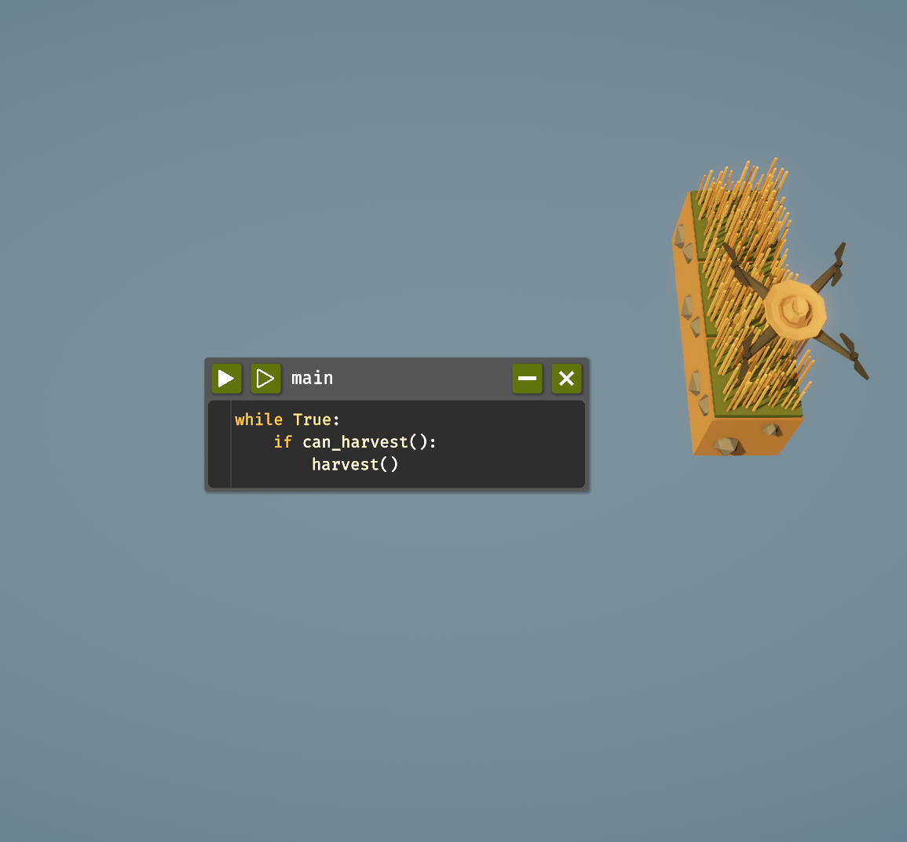
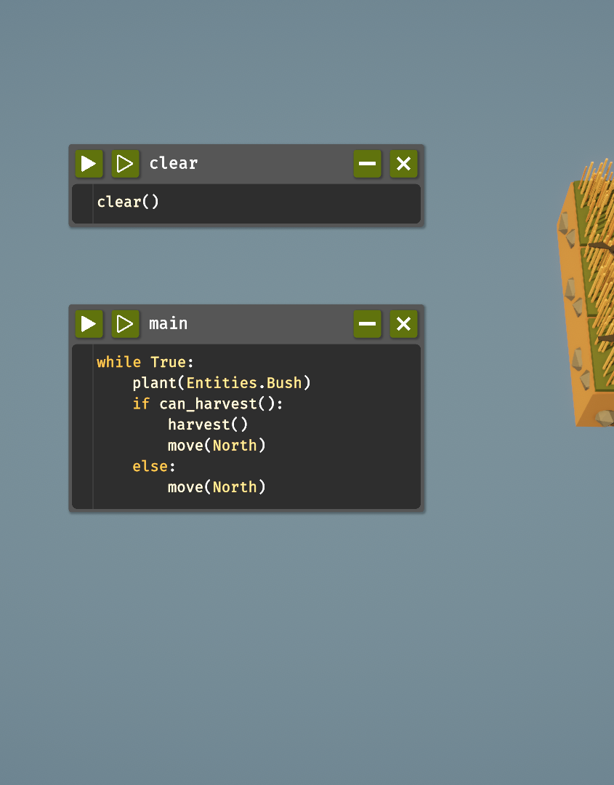
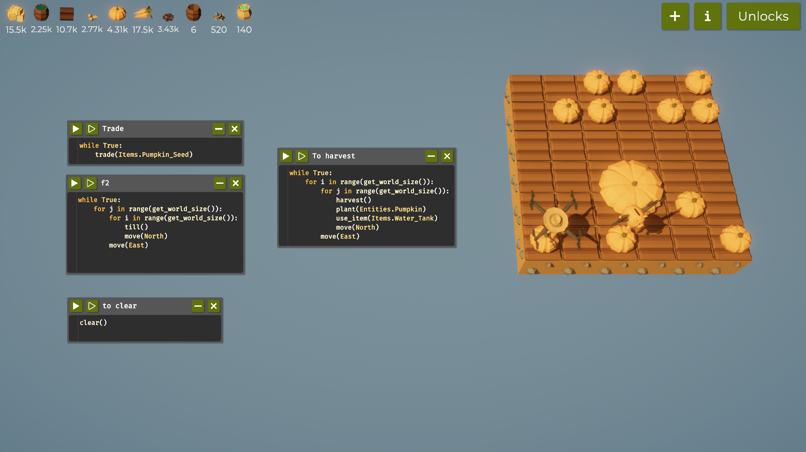

# Programming the Farming Drone (Report)
## Introduction
The Farmer Was Replaced is a game where we use simple coding to control a drone that runs a farm. 
We write commands to make the drone plant, water, and harvest crops on its own. The main goal is to make 
the farm work smoothly and grow lots of plants by creating good instructions for the drone. This helps 
us to practice coding while playing a fun farming game.

# Table of Contents
- [Code Snippets and Explanation](#code-snippets-and-explanation)
- [Challenges and Learnings](#challenges-and-learnings)
- [References](#references)

# Code-Snippets-and-Explanation

## Step 1: Farming on 1 tile
**Code:**
```python 
while True:
    harvest()
```
**Explanation:**
Here, in the begining the code runs an infinite number of times and harvest the grass with the if condition.

**Demo:**
- Screenshots:

- Video Demo:


**Notes**
- Using the code above I was able to get enough hay to unlock the loop, speed and grass plus expand the farm.
- Features unlocked: if else condition.


## Step 2: Farming on 3x1 and 3x3 tile
**Code:**
```python
while True:
	plant(Entities.Bush)
	if can_harvest():
		harvest()
		move(North)
	else:
		move(North)
```
```python
while True:
	for i in range(get_world_size()):
		for j in range(get_world_size()):
			harvest()
			plant(Entities.Bush)
			move(North)

		move(East)
```
**Explanation:**
This code repeatedly goes through the grid row by row. For each cell, it Harvests any resource from a bush and replants a new bush.
After that moves north through all cells in the row, and then moves east to the next row.
This ensures every cell in the grid gets harvested and replanted continuously, which could maximize 
resource collection over time if bushes keep growing.

**Demo:**
- Screenshots:

- Video Demo:


**Notes**
- Using the code above I was able to get enough hay to unlock the senses and operators.
- Features unlocked: operation, variable, functions.


## Step 3: Farming on 6x6 tile
**Code:**
```python
# to trade
while True:
	trade(Items.Pumpkin_Seed)

# to clear
clear()

# to till
while True:
	for j in range(get_world_size()):
		for i in range(get_world_size()):
			till()
			move(North)
		move(East)

# to harvest
while True:
	for i in range(get_world_size()):
		for j in range(get_world_size()):
			harvest()
			plant(Entities.Carrots)
			use_item(Items.Water_Tank)
			move(North)
		move(East)
```
**Explanation:**
In order to harvest carrots and pumpkins, i used this code (# to harvest) where it performs a harvesting, 
planting, and watering operation on each cell in a grid, row by row. After processing a row (moving north 
through each cell), it moves one column east and repeats until every cell in the grid has been processed, then 
restarts indefinitely.

But before harvesting i used (# till) code because in farming, tilling is often a preparatory action. Tilling 
the ground (i.e., breaking up and loosening the soil) is typically necessary to make it suitable for planting seeds. 
By tilling the soil first, the code ensures that each cell in the grid is ready for the next steps in the farming 
process, such as planting seeds and watering. So, in this context, the code continuously tills the grid to keep the 
soil in each cell in a prepared state, likely as part of a loop that may follow with planting and watering actions. It 
ensures every cell is consistently ready for planting, which is especially useful if the ground resets or needs 
maintenance periodically in the simulation. 

(# to trade) I have used this code since it is a simple infinite loop where the trade function is called repeatedly 
to trade items such as, Pumpkin seed, Carrot seed, Empty tank, Sunflower seed and many more without stopping.

**Demo:**
- Screenshots:

- Video Demo:


**Notes**
- Using these codes above I was able to get enough hay, bush, carrot, pumpkin, water tank, sunflower, fertilizer 
and many more by just changing the items as per the needs which have helped me to unlock the trees, watering, 
utilities, multi trade, list, polyculture, fertilizer, maze.
- Features unlocked: multi trading, farming equipments


# Challenges and Learnings
## Challenges
Challenges Faced:
1. Managing Crop Growth and Harvesting
Timing of the growth and harvest cycles was tricky. If crops grow too quickly, we get overwhelmed; too slowly, and 
it feels boring.

3. Optimizing Bot Paths
If harvest bots go the long way around, it slows down the game. Finding ways to make them take shorter, efficient 
paths was challenging.

3. Balancing Manual and Automated Tasks
We need to decide which tasks to automate and which to handle themselves. Automating everything is tempting, but 
it makes things too costly or complex early on.

4. Managing Resources Efficiently
We have to juggle water, seeds, and tools. Poor resource management can slow down progress, making it essential to 
plan ahead to keep crops growing smoothly.


Optimizations for Faster Harvesting
1. Efficient Bot Routes
I used pathfinding algorithms to help bots move directly to crops, avoiding obstacles and saving time.

2. Reusing Objects
By reusing visual and sound effects instead of creating new ones each time, the game ran smoother.

3. Showing Only Visible Objects
I made it so only objects in view are displayed, reducing the workload on the game's graphics.

4. Upgrade Harvesting Speed
Unlocking upgrades to make bots harvest faster as they progress.

5. Energy Upgrades for Bots
Upgrading bot energy so they don't need to recharge as often, meaning they can harvest longer without stopping.
 
## Learnings
- Priority Queues:
I used priority queues to make bots or drones focus on high-priority tasks first, such as harvesting fully grown 
crops before others. This ensures that actions are done in an order that saves time.

- Event-driven Programming for Resource Management:
I learned to use event-driven programming so actions like harvesting, watering, or selling are triggered only when 
specific conditions are met, saving resources and processing power.

- Binary Search for Finding Ready Crops Quickly:
I implemented a binary search to quickly locate fully grown crops in a sorted list, allowing bots to locate and 
harvest them faster.

- Timers and Scheduling for Task Management:
I applied a scheduling algorithm that makes bots wait until a certain number of crops are ready before harvesting. 
This method groups tasks and prevents frequent, small trips, saving time


## References
1. [CODE, FARM, AUTOMATE: The Farmer Was Replaced] (https://youtu.be/gmJ357XAAdE?si=s7kwdR6pZ3hQbh0y)
2. [The Farmer Was Replaced] (https://youtu.be/-hdhyKf2aN8?si=OiaCb2Ff3BJ0Qmb2)
 